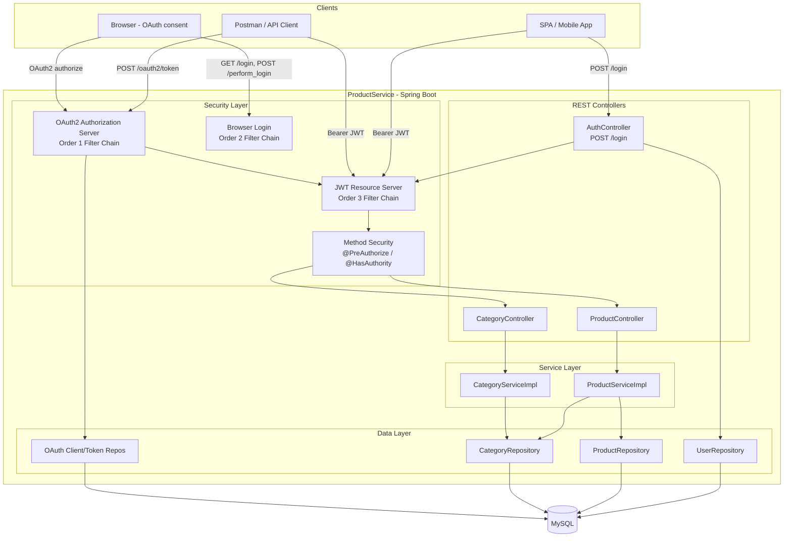
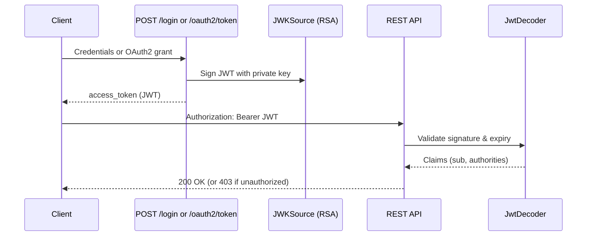

# ProductService — Application Architecture

## Overview

ProductService is a Spring Boot 4.0.6 monolith that exposes REST APIs for product and category (catalog) management. All business APIs are protected by **JWT Bearer token authentication**. The application combines three security concerns in a single deployable unit:

1. **REST API layer** — product and catalog endpoints
2. **JWT Resource Server** — validates Bearer tokens on every API request
3. **OAuth2 Authorization Server** — issues JWT access tokens via OAuth2 flows

Users are stored in MySQL via JPA. Roles are embedded in JWT claims and enforced with Spring Method Security (`@PreAuthorize`, `@HasAuthority`).

---

## Technology Stack

| Layer | Technology |
|-------|------------|
| Runtime | Java 17 |
| Framework | Spring Boot 4.0.6 |
| Web | Spring Web MVC |
| Persistence | Spring Data JPA, Hibernate, MySQL |
| Security | Spring Security 7, OAuth2 Authorization Server, OAuth2 Resource Server |
| Token format | JWT (RSA-signed via JWK) |
| Password hashing | BCrypt |
| Build | Maven |

---

## High-Level Architecture



---

## Package Structure

```
org.bgm.productservice
├── ProductServiceApplication.java     # Entry point
├── controllers/
│   ├── AuthController.java            # POST /login → JWT
│   ├── ProductController.java         # /product, /products
│   └── CategoryController.java        # /category, /catalog
├── services/
│   ├── ProductServiceImpl.java
│   └── CategoryServiceImpl.java
├── repository/                        # JPA repositories (domain)
├── model/                             # Product, Category entities
├── dtos/                              # Request/response DTOs
├── config/
│   ├── SecurityConfig.java            # 3 filter chains, JWT beans
│   ├── MethodSecurityConfig.java      # @EnableMethodSecurity
│   └── GlobalExceptionHandler.java
└── security/
    ├── models/                        # User, OAuth Client, Authorization
    ├── repositories/                  # User, OAuth JPA repos
    ├── services/                      # CustomUserDetailService, OAuth JPA services
    ├── AuthenticationSuccessLogger.java  # Logs user/roles/authorities after login
    └── HasAuthority.java              # Custom authorization annotation
```

---

## Security Architecture (Three Filter Chains)

Spring Security is configured with **three ordered filter chains**. Each chain handles a distinct set of URLs.

| Order | Chain | Session | Purpose |
|-------|-------|---------|---------|
| 1 | Authorization Server | Session-based | OAuth2/OIDC endpoints (`/oauth2/*`) |
| 2 | Browser Login | Session-based | HTML form login for OAuth consent flow |
| 3 | API (Resource Server) | **Stateless** | All REST APIs — JWT Bearer required |

**Key design decision:** REST APIs do **not** accept session cookies. Regardless of how a JWT is obtained (REST login or OAuth2), API access always requires:

```
Authorization: Bearer <access_token>
```

---

## JWT Lifecycle



### JWT Claims

| Claim | Description |
|-------|-------------|
| `iss` | Issuer — `http://localhost:8080` |
| `sub` | Username (login) or client principal (OAuth2) |
| `iat` / `exp` | Issued at / expiry (login tokens: 3600 seconds) |
| `authorities` | Set of role strings, e.g. `["Admin"]` |

---

## Data Model

### Domain

| Entity | Table | Description |
|--------|-------|-------------|
| `Product` | `Product` | title, price, description, image, category |
| `Category` | `ProductCategory` | name, description |

### Security

| Entity | Table | Description |
|--------|-------|-------------|
| `User` | `app_product_user` | username, BCrypt password, roles[] |
| `Client` | `client` | OAuth2 registered client |
| `Authorization` | `authorization` | OAuth2 tokens and codes (JPA-backed) |

### User Roles

Roles are stored as plain strings (no `ROLE_` prefix):

- `Admin` — can create/update products and categories (`POST /product`, `POST /category`, `PUT /category/{id}`)
- `USER` — can read products and catalog (any authenticated JWT)

Loaded by `CustomUserDetailService` from MySQL and embedded in JWT at token issuance.

After successful login, `AuthenticationSuccessLogger` records the user, database roles, and Spring authorities in the application log.

---

## Authorization Model

Two layers of authorization work together (see [05-spring-security-flow.md](05-spring-security-flow.md) for full `@PreAuthorize` explanation):

1. **Filter chain (Order 3)** — request must carry a valid JWT (`authenticated()` → 401 if missing/invalid)
2. **Method security** — per-endpoint rules on controller methods (403 if denied)

| Endpoint | Method Security |
|----------|-----------------|
| `GET /products/`, `GET /product/{id}` | `@PreAuthorize("isAuthenticated()")` |
| `GET /category/`, `GET /catalog/` | `@PreAuthorize("isAuthenticated()")` |
| `POST /product` | `@HasAuthority("Admin")` |
| `POST /category`, `POST /catalog` | `@HasAuthority("Admin")` |
| `PUT /category/{id}`, `PUT /catalog/{id}` | `@HasAuthority("Admin")` |
| `POST /login` | Public (no JWT required) |

---

## External Dependencies

| Dependency | Purpose |
|------------|---------|
| MySQL (`productservicedb`) | Primary datastore |
| In-memory RSA key pair | JWT signing (regenerated on each app restart) |

> **Production note:** Persist the RSA key pair across restarts (e.g. keystore file or secrets manager) so tokens remain valid after redeployment.

---

## Startup Prerequisites

1. MySQL running with database `productservicedb`
2. Application user seeded (run `CreateFirstUserTest` once)
3. OAuth2 client seeded (run `OAuthClientInsertTest` once) — required for OAuth2 flows

Default server: `http://localhost:8080`
