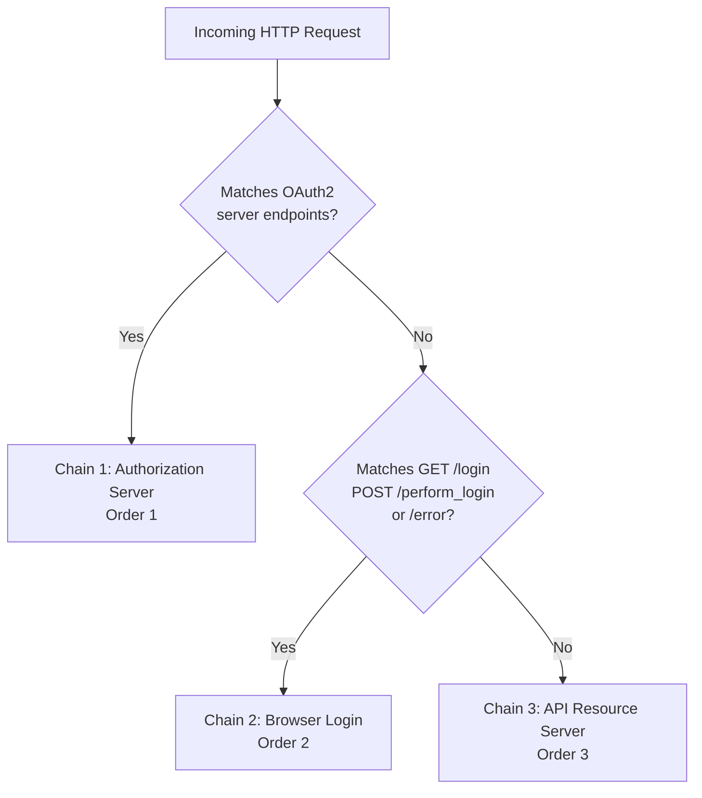
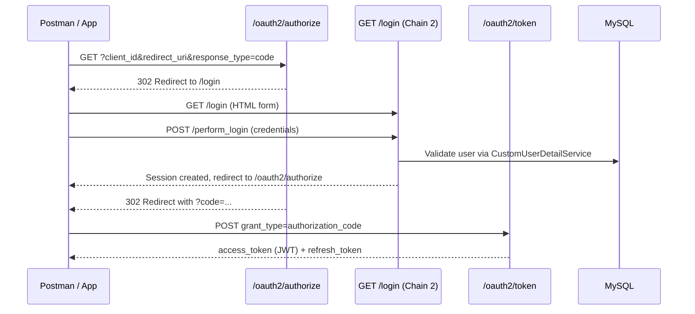
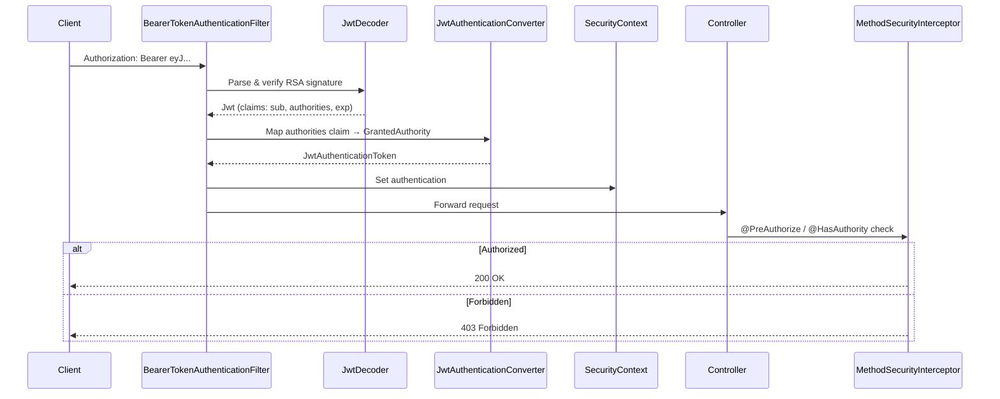
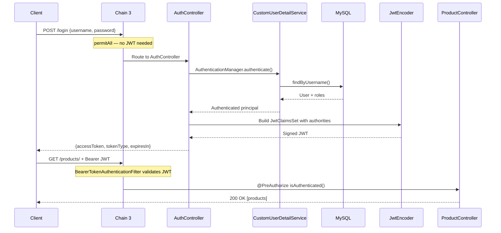
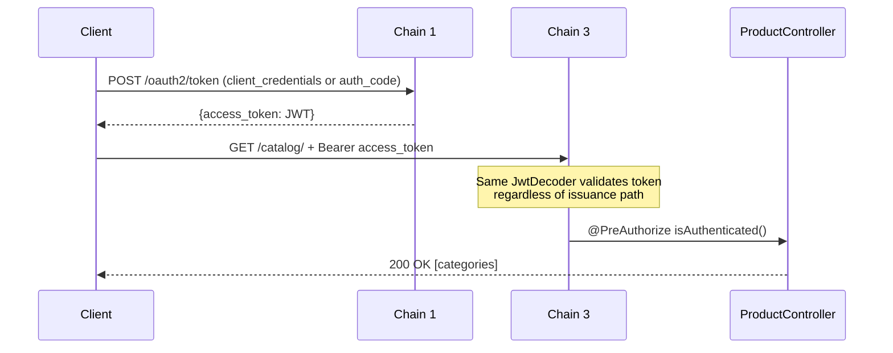

# ProductService — Spring Security Flow

This document describes how Spring Security processes requests for all paths leading to REST API access.

---

## Filter Chain Overview

ProductService configures **three `SecurityFilterChain` beans** with explicit `@Order`. Spring Security evaluates chains in order; the first matching chain handles the request.



| Chain | Order | URL Matcher | Session | Auth Mechanism |
|-------|-------|-------------|---------|----------------|
| Authorization Server | 1 | `/oauth2/**`, `/.well-known/**` | Session | Client auth + user login for consent |
| Browser Login | 2 | `GET /login`, `POST /perform_login`, `/error` | Session | Form login (username/password) |
| API Resource Server | 3 | Everything else | **Stateless** | JWT Bearer token |

---

## Chain 1 — OAuth2 Authorization Server (Order 1)

**Purpose:** Issue OAuth2/OIDC tokens. Handles authorization code, refresh token, and client credentials flows.

### Matched Paths

| Path | Description |
|------|-------------|
| `/oauth2/authorize` | Start authorization code flow |
| `/oauth2/token` | Exchange code or request client credentials token |
| `/oauth2/jwks` | Public JSON Web Key Set |
| `/oauth2/introspect` | Token introspection |
| `/oauth2/revoke` | Token revocation |
| `/.well-known/openid-configuration` | OIDC discovery document |
| `/.well-known/oauth-authorization-server` | OAuth2 metadata |

### Security Rules

- All endpoints require authentication (client or user)
- Unauthenticated browser requests redirect to `GET /login`
- OIDC enabled (`.oidc(Customizer.withDefaults())`)
- JWT tokens signed with in-memory RSA key pair (`JWKSource`)
- User authorities embedded in access token via `OAuth2TokenCustomizer`

### Flow — Authorization Code



---

## Chain 2 — Browser Login (Order 2)

**Purpose:** Provide HTML form login for the OAuth2 authorization code consent flow. Does **not** protect REST APIs.

### Matched Paths

| Method | Path | Access |
|--------|------|--------|
| `GET` | `/login` | Public — shows login form |
| `POST` | `/perform_login` | Public — processes form credentials |
| `*` | `/error` | Public — error page |

### Security Rules

- All matched requests: `permitAll()`
- Form login configured:
  - Login page: `GET /login`
  - Processing URL: `POST /perform_login` (not `POST /login`)
  - Success handler: `LoggingAuthenticationSuccessHandler` logs user, roles, and authorities
- Session-based (supports OAuth redirect flow)

> **Important:** `POST /login` is **not** handled by this chain. It is handled by Chain 3 and routed to `AuthController` for JSON JWT login.

---

## Chain 3 — API Resource Server (Order 3)

**Purpose:** Protect all REST APIs. Validates JWT Bearer tokens. This is the chain every API client interacts with.

### Matched Paths

All requests not matched by Chain 1 or Chain 2, including:

| Method | Path | Public? |
|--------|------|---------|
| `POST` | `/login` | Yes — returns JWT JSON |
| `GET` | `/products/` | No — JWT required |
| `GET` | `/product/{id}` | No — JWT required |
| `POST` | `/product` | No — JWT + Admin authority |
| `POST` | `/category`, `/catalog` | No — JWT + Admin authority |
| `PUT` | `/category/{id}`, `/catalog/{id}` | No — JWT + Admin authority |
| `GET` | `/catalog/` | No — JWT required |
| `GET` | `/category/` | No — JWT required |

### Security Rules

```
csrf: disabled
session: STATELESS
authorize:
  POST /login → permitAll
  any other request → authenticated
oauth2ResourceServer:
  jwt decoder + authentication converter
```

### JWT Validation Flow



### JWT Authority Mapping

```java
// authorities claim in JWT → Spring GrantedAuthority (no ROLE_ prefix)
JwtGrantedAuthoritiesConverter:
  authoritiesClaimName = "authorities"
  authorityPrefix = ""
```

Example JWT payload:

```json
{
  "iss": "http://localhost:8080",
  "sub": "ravik775@gmail.com",
  "authorities": ["Admin"],
  "iat": 1718384000,
  "exp": 1718387600
}
```

---

## Method Security Layer

After the filter chain authenticates the JWT, **method-level security** enforces authorization on controller methods.

Enabled via `@EnableMethodSecurity` in `MethodSecurityConfig`.

| Annotation | Used On | Rule |
|------------|---------|------|
| `@PreAuthorize("isAuthenticated()")` | GET product/category endpoints | Any valid JWT holder |
| `@HasAuthority("Admin")` | `POST /product`, `POST /category`, `PUT /category/{id}` | JWT must contain `Admin` in `authorities` |

`@HasAuthority` is a custom meta-annotation:

```java
@PreAuthorize("hasAuthority('{value}')")
public @interface HasAuthority {
    String value();
}
```

---

## Why `@PreAuthorize("isAuthenticated()")` Is Needed

ProductService applies security in **two layers**. Understanding both explains why read endpoints use `@PreAuthorize("isAuthenticated()")` even though the filter chain already requires authentication.

### Layer 1 — HTTP filter chain (coarse-grained)

Chain 3 (API Resource Server) configures:

```java
http.authorizeHttpRequests(auth -> auth
    .requestMatchers(HttpMethod.POST, "/login").permitAll()
    .anyRequest().authenticated());
```

This rejects requests **before they reach a controller** when:

- No `Authorization: Bearer` header is present
- The JWT is expired, tampered with, or signed with the wrong key

Result: **401 Unauthorized** from `BearerTokenAuthenticationFilter`.

### Layer 2 — Method security (fine-grained)

`@PreAuthorize` on controller methods is evaluated **after** the JWT is validated and the `SecurityContext` is populated. It defines **what an authenticated caller may do on each method**.

| Concern | Filter chain | `@PreAuthorize` |
|---------|--------------|-----------------|
| Scope | Entire HTTP request | Individual controller method |
| Question answered | "Is the caller authenticated?" | "Is this caller allowed to invoke **this** method?" |
| Failure | 401 Unauthorized | 403 Forbidden |
| Configuration | `SecurityConfig` | Controller annotations |

### Reasons we use `@PreAuthorize("isAuthenticated()")` on GET endpoints

**1. Different rules on the same controller**

`ProductController` and `CategoryController` mix read and write operations:

- **GET** — any authenticated caller (`Admin`, `USER`, or OAuth2 client-credentials token)
- **POST/PUT** — only callers with `Admin` authority (`@HasAuthority("Admin")`)

Method security is the natural place to express that split. The filter chain alone cannot distinguish `GET /products/` from `POST /product` without duplicating URL rules.

**2. Explicit, self-documenting authorization**

An annotation on the method states the policy where developers look first — the controller — instead of burying it only in `SecurityConfig`.

**3. Defense in depth**

If the filter chain is later relaxed (for example, `permitAll()` added for debugging), `@PreAuthorize` still protects individual methods. Failures surface as **403 Forbidden** via `AuthorizationDeniedException`, handled by `GlobalExceptionHandler`.

**4. Supports OAuth2 client-credentials read access**

Machine clients that obtain a token via `grant_type=client_credentials` are **authenticated** but typically do **not** have the `Admin` role. `@PreAuthorize("isAuthenticated()")` allows them to read `/products/` and `/catalog/` while `@HasAuthority("Admin")` correctly blocks them from creating products or categories.

**5. Consistent with Spring Method Security testing**

Integration and unit tests use `@WithMockUser` and JWT-based MockMvc calls. Method-level annotations ensure the same authorization rules apply whether the caller is a browser client, Postman, or a test.

### Why not use `@HasAuthority("USER")` for reads?

That would **exclude** valid authenticated callers who lack a `USER` role — including OAuth2 client-credentials tokens and users whose DB role is only `Admin`. `isAuthenticated()` means "any proven identity with a valid JWT," which matches the intended read policy.

### Why not omit `@PreAuthorize` on GET if the filter already requires authentication?

Technically, an authenticated request would reach the controller without it. We keep the annotation because:

- It documents the read policy explicitly
- It pairs symmetrically with `@HasAuthority("Admin")` on write methods
- It activates method security consistently across the API
- It protects against future filter-chain changes

### Summary

```
Request → [Filter: valid JWT?] → 401 if no
        → [Method: @PreAuthorize / @HasAuthority] → 403 if denied
        → Controller method executes → 200 OK
```

- **`authenticated()` in the filter chain** = "You must present a valid JWT to enter the API."
- **`@PreAuthorize("isAuthenticated()")` on GET** = "This read operation is available to any valid JWT holder."
- **`@HasAuthority("Admin")` on POST/PUT** = "This write operation requires the Admin role."

---

## Authentication Success Logging

After a successful login, `AuthenticationSuccessLogger` writes an INFO log line:

```
Authentication successful | user=admin@test.com | roles=[Admin] | authorities=[Admin, FACTOR_PASSWORD]
```

| Field | Source |
|-------|--------|
| `user` | Authenticated username |
| `roles` | Roles stored in `app_product_user` (database) |
| `authorities` | Spring Security granted authorities (includes DB roles plus framework entries such as `FACTOR_PASSWORD`) |

Triggered from:

- `POST /login` — `AuthController` after `AuthenticationManager.authenticate()` succeeds
- `POST /perform_login` — `LoggingAuthenticationSuccessHandler` after form login (OAuth browser flow)

---

### Authorization Decision Flow

```mermaid
flowchart TD
    A[Request reaches Controller] --> B{Valid JWT in<br/>SecurityContext?}
    B -->|No| C[401 Unauthorized<br/>BearerTokenAuthenticationFilter]
    B -->|Yes| D{@PreAuthorize /<br/>@HasAuthority check}
    D -->|isAuthenticated - pass| E[Execute method]
    D -->|hasAuthority Admin - user has Admin| E
    D -->|hasAuthority Admin - missing| F[403 Forbidden<br/>AuthorizationDeniedException]
    E --> G[200 OK + response body]
```

---

## Complete End-to-End Flow: Login → API Access

### Path A: REST Login



### Path B: OAuth2 Token → API Access



---

## Path Reference — All Routes

### Public (No JWT)

| Method | Path | Chain | Handler |
|--------|------|-------|---------|
| `POST` | `/login` | 3 | `AuthController.login()` |
| `GET` | `/login` | 2 | Spring form login page |
| `POST` | `/perform_login` | 2 | Spring form login processor |
| `GET` | `/error` | 2 | Spring error page |

### OAuth2 Server (Client/User Auth — Not REST API)

| Method | Path | Chain |
|--------|------|-------|
| `GET` | `/oauth2/authorize` | 1 |
| `POST` | `/oauth2/token` | 1 |
| `GET` | `/oauth2/jwks` | 1 |
| `POST` | `/oauth2/introspect` | 1 |
| `POST` | `/oauth2/revoke` | 1 |
| `GET` | `/.well-known/openid-configuration` | 1 |

### Protected REST APIs (JWT Bearer Required)

| Method | Path | Chain | Method Security |
|--------|------|-------|-----------------|
| `GET` | `/products/` | 3 | `isAuthenticated()` |
| `GET` | `/product/{id}` | 3 | `isAuthenticated()` |
| `POST` | `/product` | 3 | `hasAuthority('Admin')` |
| `POST` | `/category`, `/catalog` | 3 | `hasAuthority('Admin')` |
| `PUT` | `/category/{id}`, `/catalog/{id}` | 3 | `hasAuthority('Admin')` |
| `GET` | `/catalog/` | 3 | `isAuthenticated()` |
| `GET` | `/category/` | 3 | `isAuthenticated()` |

---

## Error Handling

| Exception | HTTP Status | Handler |
|-----------|-------------|---------|
| Missing/invalid JWT | 401 | Spring Security `BearerTokenAuthenticationFilter` |
| `AuthorizationDeniedException` | 403 | `GlobalExceptionHandler` |
| `AccessDeniedException` | 403 | `GlobalExceptionHandler` |
| `NotFoundException` | 404 | `GlobalExceptionHandler` |
| `CreationException` | 400 | `GlobalExceptionHandler` |

---

## Key Security Beans

| Bean | Class / Type | Role |
|------|--------------|------|
| `jwkSource` | `JWKSource<SecurityContext>` | RSA key pair for sign/verify |
| `jwtEncoder` | `NimbusJwtEncoder` | Signs JWTs (login + OAuth2) |
| `jwtDecoder` | `JwtDecoder` | Validates JWTs on API requests |
| `jwtTokenCustomizer` | `OAuth2TokenCustomizer` | Adds `authorities` to OAuth2 tokens |
| `jwtAuthenticationConverter` | `JwtAuthenticationConverter` | Maps JWT claims → authorities |
| `authenticationManager` | `ProviderManager` | Authenticates login credentials |
| `authenticationSuccessLogger` | `AuthenticationSuccessLogger` | Logs user, roles, authorities after login |
| `loginSuccessHandler` | `LoggingAuthenticationSuccessHandler` | Form login success + redirect |
| `passwordEncoder` | `BCryptPasswordEncoder` | Hashes passwords |
| `authorizationServerSettings` | `AuthorizationServerSettings` | Issuer URL config |

---

## Security Invariants

1. **APIs are stateless** — no session cookie grants API access
2. **Single JWT validation path** — tokens from `/login` and `/oauth2/token` use the same `JwtDecoder`
3. **Roles in JWT** — `authorities` claim drives `@HasAuthority` checks
4. **Form login is OAuth-only** — `POST /perform_login` supports browser OAuth consent, not API access
5. **RSA keys are in-memory** — tokens become invalid after application restart unless keys are persisted
